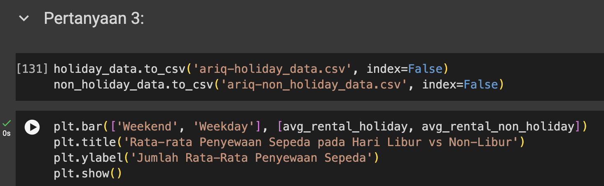

# Panduan import dataset

1. Buka project [Google Collab](https://colab.research.google.com/drive/1zYyIso2jyhpPnGbUJ9NR32XWgyiylQ4x?usp=sharing)
2. Export dataframe terakhir yang sudah melalui tahap cleaning data. Sebagi contoh, dalam visualisasi ini menggunakan dataframe `holiday_data` dan `non_holiday_data`



```python
# export dataframe tersebut menjadi csv
holiday_data.to_csv('ariq-holiday_data.csv', index=False)
non_holiday_data.to_csv('ariq-non_holiday_data.csv', index=False)
```

3. Download dan masukkan ke folder ini.
4. Import dataset ke pages

```python
import pandas as pd
import streamlit as st

holiday_data = pd.read_csv('dataset/ariq-holiday_data.csv')
non_holiday_data = pd.read_csv('dataset/ariq-non_holiday_data.csv')
```

5. Cek dataframe apakah sudah berhasil di import atau belum

```python
st.dataframe(holiday_data)
```

6. Jalankan Streamlit di terminal

```bash
streamlit run main.py
```
